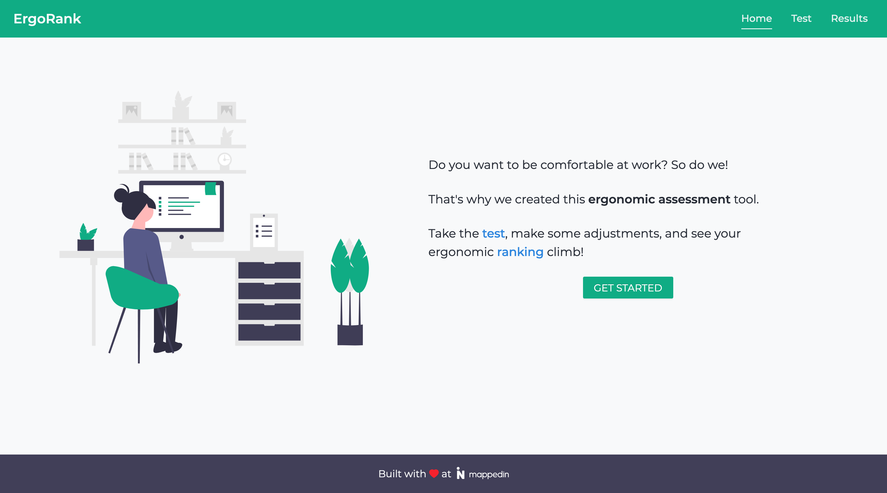

<h1 align="center">Ergo Rank</h1>
<h2 align="center">
    <a href="https://ergorank.com/">ergorank.com</a>
</h2>
<h3 align="center">An ergonomic assessment tool that helps you optimize your desk setup</h3>

    
    

## 📷 Screenshots

## 🚀 Getting Started
#### 🔩 Installation
To clone the repo and install dependencies:

    git clone https://github.com/charlesdobson/ergo-rank.git
    cd ergo-rank
    yarn install

#### 🔧 Development
To start the development server on port `3000` and open the application in the browser:

    yarn start
    
#### 🔨 Production
To build the application for production:

    yarn build

## 🏆 Tests

To run the tests:

    yarn test

## 🔒 License
This project is licensed under the terms of the [MIT License](/LICENSE)